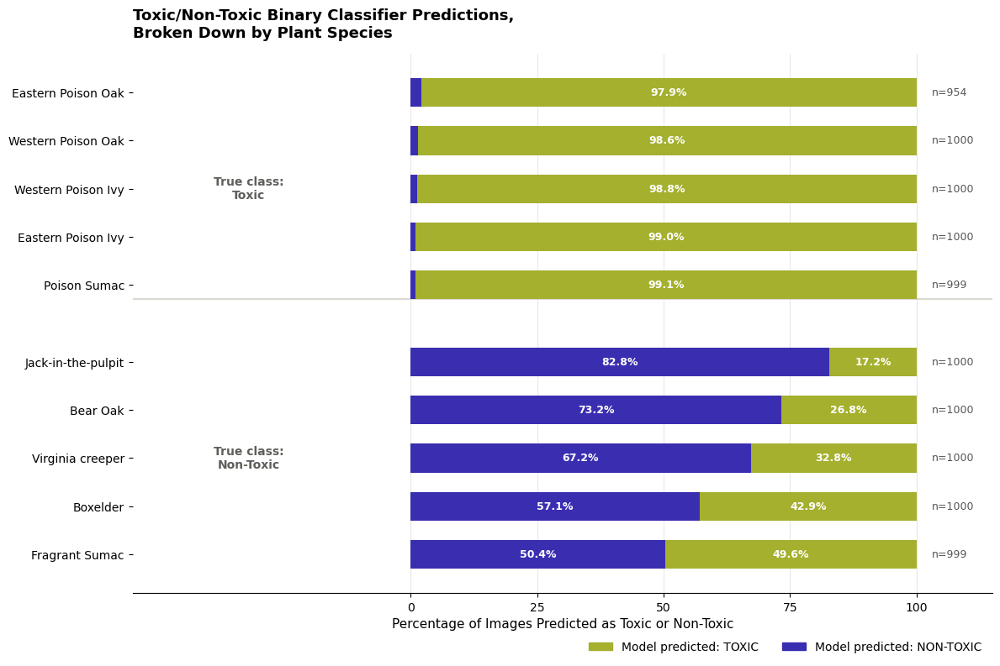

# Capstone3: Toxic vs. Non-Toxic Plant Classification from Images

## Problem Statement
Accidental exposure to poisonous plants is a recurring, preventable safety risk for hikers, pet owners, gardeners, and parents who may encounter unfamiliar plants in remote or unmonitored environments. This project set out to build an image-based classifier that classifies a plant image as toxic or non-toxic, so that anyone with a phone camera can get a fast, reliable answer about whether a plant in front of them is dangerous to touch.

## The Data
[Toxic Plant Classification dataset ](https://www.kaggle.com/datasets/hanselliott/toxic-plant-classification) — 9,952 images across 10 species, 5 toxic and 5 non-toxic.

The dataset is well balanced — 9 of 10 species have 999–1,000 images, and the overall toxic/non-toxic split is 4,953 / 4,999.

## Data Wrangling and EDA
[Data Wrangling and EDA Notebook](https://github.com/segoldsmith/Capstone3_PlantToxicity/blob/main/Capstone3_DataWrangling_EDA.ipynb)

Data Wrangling of the metadata for the image dataset was minimal. There was no missing data, however there was a need to remove unnecessary feature columns, such as class id and species label. Additional feature columns for image orientation and color based properties were created to allow for more analysis of the data.

During EDA, Image orientation returned a statistically significant association to the distribution of toxic vs non-toxic images across the data set: landscape images were disproportionately toxic, and portrait images disproportionately non-toxic.

Color-based features of brightness, contrast, hue, and saturation were also examined across both toxicity and species groupings. These features were largely similar across classes and across species, with a minor exception that there was a slightly higher range of saturation in the toxic class.

Both possible issues were dealt with in the preprocessing step to ensure there was no data leakage.

## Preprocessing and Modeling
[Preprocessing and Modeling Notebook](https://github.com/segoldsmith/Capstone3_PlantToxicity/blob/main/Capstone3_pre-processing-modeling.ipynb)

All images were resized and normalized for a standard 224×224 input pipeline, with heavy data augmentation on the training set: random resized cropping, horizontal and vertical flips, rotation, color jitter, light affine and perspective distortion, and random erasing. The dataset was split 80/20 into training and validation sets. Three CNN models stages were run, each building on lessons from the last.
The first two models were tested to get a baseline of which would be used to tune for better training. After both went through 15 epochs, the basic EfficientNet model performed better than the ResNet model, so the third model used the EfficientNet backbone, but was trained in a far more deliberate way, combining several techniques aimed squarely at the recall objective, including class weighting, Mixup and CutMix Augmentation, and a three phase training schedule. 

The default classification threshold of 0.5 treated a missed toxic plant and a false alarm as equally costly, which does not reflect the real priorities of this project. To close the gap to the recall target without retraining, the model’s confidence scores were first calibrated using temperature scaling (learned temperature ≈ 0.83). Then the classification threshold was tuned by sweeping values and selecting the one optimized the balance between the F2 score, recall, precision, and false negatives, focusing primarily on the F2 score, a metric that weights recall more heavily than precision, matching the project’s safety-first priority.

The tuned threshold of 0.28 was chosen, as the model reached 95.4% recall, 73.6%, precision, 90% F2 score, and had fewer than 50 false negatives. on the held-out validation set (F2 = 0.900), clearing the 90% recall target with room to spare.

## Findings: How the Model Performs in Practice
The final calibrated model (binary, threshold = 0.28) was run against the full dataset, then results were grouped by species purely for analysis. 

The results tell a clear and consistent story. Every toxic species was identified correctly 98–99% of the This is exactly the behavior the project was optimized for: the model essentially never lets a toxic plant slip through as “safe.”
Non-toxic species tell a very different story. Accuracy ranged from a high of 83% (Jack-in-the-pulpit) down to just 50% (Fragrant Sumac) and 57% (Boxelder).

This pattern is the single most important finding of the project. A 95% recall headline number is accurate but incomplete on its own. The practical experience of a user photographing a Fragrant Sumac or Boxelder plant would be a false toxic warning roughly half the time. That is an acceptable, even sensible, trade-off for a tool whose entire purpose is to err on the side of caution around safety, but it is a trade-off that should be communicated honestly to anyone using the tool, rather than discovered by surprise.

## Ideas for Further Research and Improvements
•	Targeted data collection or augmentation for the weakest non-toxic species (Fragrant Sumac, Boxelder, Virginia Creeper) to give the model more examples of the specific features that distinguish them from their toxic look-alikes, rather than relying on a single global threshold to compensate. 

•	Collecting or sourcing field photos (rather than the curated dataset images used here) to validate that performance holds up on the messier, more varied images real users would actually submit — different lighting, backgrounds, partial views, and camera quality.

•	Integration of geolocation and seasonal metadata to give the model more features to train on.

•	Species-level classification as a second-stage model: once an image is flagged toxic, a follow-up model identifying which of the five toxic (or five non-toxic) species it most resembles could let users sanity-check a toxic flag, directly addressing the false-positive concern surfaced above. This was the stretch goal noted in the original proposal and remains a natural next step.

•	Expanding beyond the current ten species to cover additional regionally common toxic and non-toxic plants, which would increase the tool’s real-world usefulness without requiring a full model redesign given the architecture already in place.

## Recommendations for the Client
1.	Deploy the tuned model (threshold 0.28) for its intended safety use case but pair every “toxic” prediction with a brief, honest caveat about false-positive rates for visually similar non-toxic species. Because the model is intentionally tuned to over-flag rather than under-flag, users should understand that a “toxic” result means “please treat this with caution,” not “this is definitely toxic,” particularly for plants resembling Fragrant Sumac or Boxelder.

2.	Prioritize the species-level follow-up model described above before any broader rollout. Because toxic-species recall is already excellent (98–99%), the highest-value next investment is reducing false alarms on non-toxic look-alikes, not further tuning the binary toxic/non-toxic threshold.

3.	Treat this model as a first-pass safety filter, not a standalone identification authority. The client should position the tool as a quick screening aid that flags “plants worth being careful around,” while still directing users toward professional identification resources (extension offices, poison control, local experts) for any plant that will be handled, ingested, or used medicinally.

